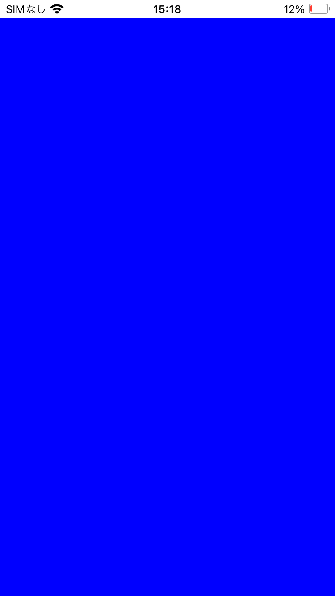

# metal-sandbox-ios

iOS Sandbox for learning Metal Shader.

This course provides a simple environment for learning shaders, assuming you want to incorporate Metal into your iOS/iPad application.

When it comes to learning GPU rendering, there are many options available today: Metal, Vulcan, OpenGL, WebGL, WebGPU... Each process is very similar, with the same core concepts and flow, but of course there are issues specific to each platform. Or they can be a bigger problem.

We aim to remove these platform-specific issues so that you can focus on learning the shaders.

## 001 Clear Color



The first thing you must do when learning shaders is to fill the screen with a specific color.

Here, 4 vertices are specified and 2 triangles are displayed. To avoid increasing the number of vertices, an index buffer is used.

The vertex shader converts the passed coordinates to a normalized coordinate system. This allows us to specify which parts of the screen are to be drawn. 

```c
vertex VertexOut clear_color_vertex_main(uint vertexID [[vertex_id]],
                             constant ClearColorVertex* vertices [[buffer(0)]],
                             constant ClearColorUniforms& uniforms [[buffer(1)]]) {
    float2 position = vertices[vertexID].position.xy;
    float2 resolution = uniforms.resolution;
    
    VertexOut out;
    out.position = vector_float4(0.0, 0.0, 0.0, 1.0);
    out.position.xy = position / (resolution / 2.0) - 1.0;
    float2 yFlip = { 1.0, -1.0 };
    out.position.xy *= yFlip;
    
    return out;
}
```

The fragment shader allows you to specify how to change the colors within the area to be drawn. 
In this example, we first filled the area with blue.

```c
[[fragment]]
float4 clear_color_fragment_main(FragmentIn in [[stage_in]]) {
    return float4(0.f, 0.f, 1.f, 1.0f);
}
```

## 003 UniformTime

